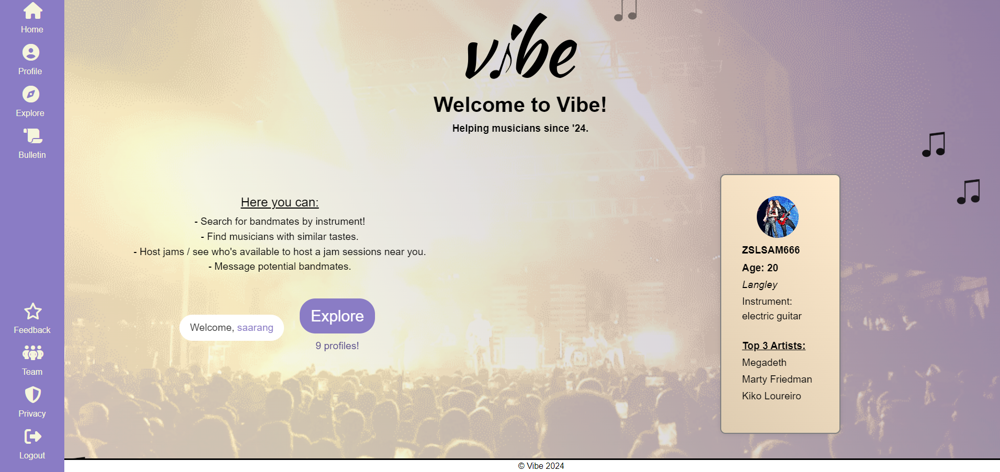
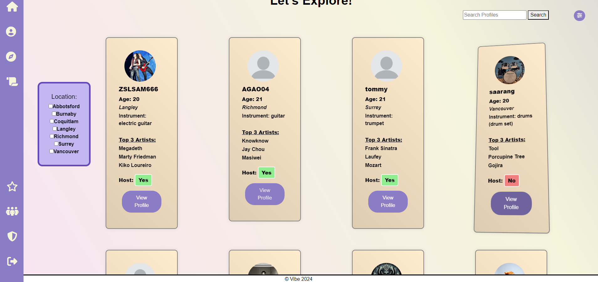
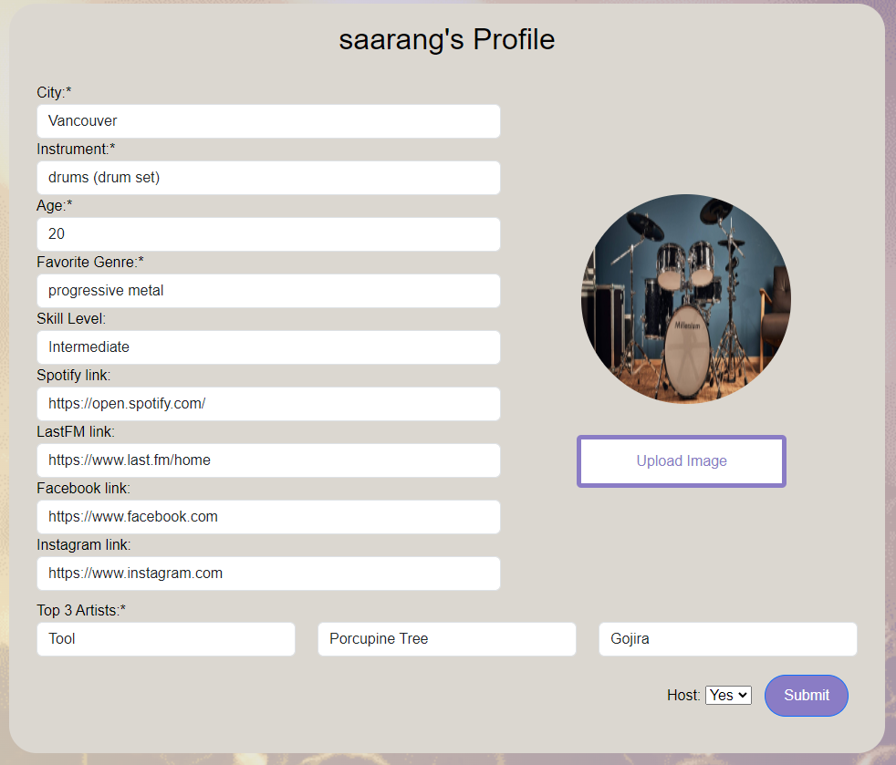
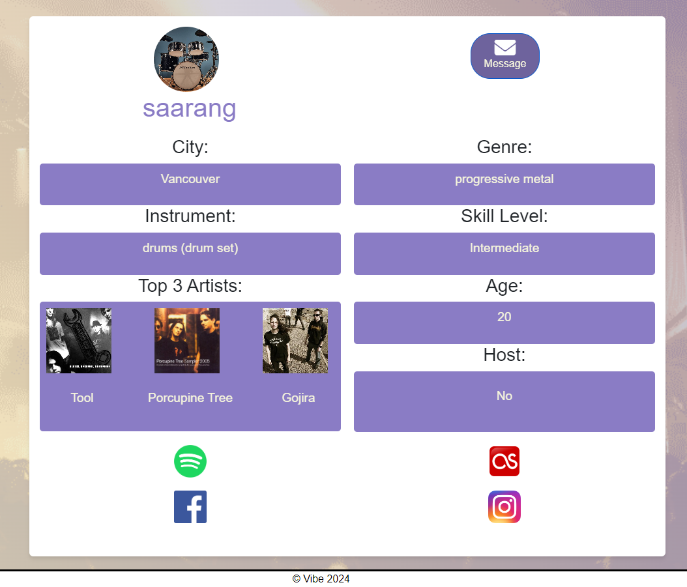
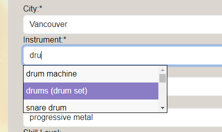
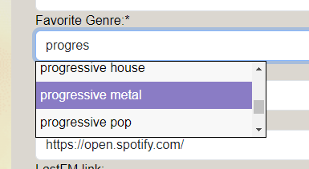
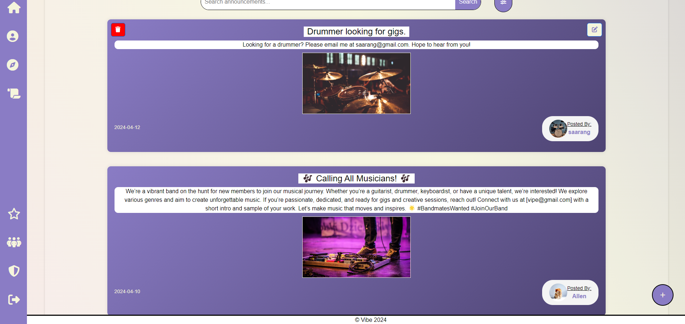

[![Contributors][contributors-shield]][contributors-url]
[![Stargazers][stars-shield]][stars-url]
[![MIT License][license-shield]][license-url]

<!-- PROJECT LOGO -->
 

  

  ### [Vibe](https://vibe-music.onrender.com/)

  

    The musician's social platform.
     
     
<!--     <a href="https://github.com/saaranganand/vibe-276">View Demo</a> -->
<!--     · -->
    <a href="https://github.com/saaranganand/vibe-276/issues/new?labels=bug&template=bug-report---.md">Report Bug</a>
    ·
    <a href="https://github.com/saaranganand/vibe-276/issues/new?labels=enhancement&template=feature-request---.md">Request Feature</a>
  

[![Java][Java]][Java-url]
[![Javascript][Javascript]][Javascript-url]
[![Spring][Spring]][Spring-url]
[![Spring Boot][Spring-Boot]][Spring-Boot-url]
[![Maven][Maven]][Maven-url]
[![Render][Render]][Render-url]
[![PostgreSQL][PostgreSQL]][PostgreSQL-url]
[![Docker][Docker]][Docker-url]
[![MusicBrainz][MusicBrainz]][MusicBrainz-url]
[![Spotify][Spotify]][Spotify-url]
[![Bootstrap.com][Bootstrap.com]][Bootstrap-url]
![HTML][HTML]
![CSS][CSS]

<!-- TABLE OF CONTENTS -->

  
Table of Contents

      <ul>
        <li>
        <a href="#about-vibe">About Vibe</a>
        </li>
    <li><a href="#gallery">Gallery</a></li>
    <li><a href="#license">License</a></li>
    <li><a href="#contact">Contact</a></li>
    <li><a href="#the-team">The Team</a></li>
      </ul>

<!-- ABOUT THE PROJECT -->
## About Vibe
'Vibe' is a social media website - built for musicians, by musicians.\
Using Vibe, you can find in your area other musicians to jam with / form a band with.\
 
After successfully creating an account, users can customize their profile with information such as which city of Metro Vancouver they reside in and their primary instrument of choice.
Vibe also focuses on genre and music taste matching, allowing users to highlight the genre they play along with up to three of their top artist inspirations.
Users can view other profiles and filter users by specific instruments to find certain roles of bandmates, as well as message users via email.
The option to link relevant social accounts such as Spotify, LastFM, Instagram and Facebook is also available to give users additional means of contact.
Vibe also helps make it easier for musicians to find others willing to host practice/jam sessions.

Members can make announcement posts on the Vibe Bulletin, accessed through the navbar. Through this, musicians can request gig opportunities and band members, or simply share their thoughts on the platform.

To mitigate malicious usage of the website, there is also an Admin system through which VibeTeam-designated admin accounts can monitor and remove users and/or individual announcement posts.

APIs we are utilizing are:\
[MusicBrainz](https://musicbrainz.org/doc/MusicBrainz_API): To retrieve artist/album images, instruments and genres.\
[Spotify](https://developer.spotify.com/documentation/web-api): To allow clicking on one of the top 3 artists to redirect to their Spotify page.\
[Hashify](https://hashify.net/): Password encryption.\

It is primarily for entertainment/recreational purposes but can be used by people looking to enter the music industry and form connections.\
Should you like to share your thoughts with us, please send us feedback via the 'Feedback' tab on the website navbar!

(Vibe is currently operating in the Metro Vancouver region exclusively.)

<!-- GALLERY -->
## Gallery

  
  
   
   
  
  
  

<!-- LICENSE -->
## License

Distributed under the MIT License. See `LICENSE.txt` for more information.

<!-- CONTACT -->
## Contact

Vibe Team - <a href="mailto:vibemusicwebsite@gmail.com">vibemusicwebsite@gmail.com</a>

Project Link: [https://github.com/saaranganand/vibe-276](https://github.com/saaranganand/vibe-276)

<!-- THE TEAM -->
## The Team

* [Saarang Anand](https://github.com/saaranganand/)
* [Allen Gao](https://github.com/allengao04)
* [Christine Song](https://github.com/csooyeonii)
* [Tommy Duong](https://github.com/pewpewninja03)
* [Shanglin Zhuang](https://github.com/zslsam1127)
  
* John D. Hoy as _acting client_
  
---

_CMPT 276 - Group 08_\
_Simon Fraser University - Spring 2024_

<!-- MARKDOWN LINKS & IMAGES -->
<!-- https://www.markdownguide.org/basic-syntax/#reference-style-links -->
[contributors-shield]: https://img.shields.io/github/contributors/saaranganand/vibe-276.svg?style=for-the-badge
[contributors-url]: https://github.com/saaranganand/vibe-276/graphs/contributors
[forks-shield]: https://img.shields.io/github/forks/saaranganand/vibe-276.svg?style=for-the-badge
[forks-url]: https://github.com/saaranganand/vibe-276/network/members
[stars-shield]: https://img.shields.io/github/stars/saaranganand/vibe-276.svg?style=for-the-badge
[stars-url]: https://github.com/saaranganand/vibe-276/stargazers
[issues-shield]: https://img.shields.io/github/issues/saaranganand/vibe-276.svg?style=for-the-badge
[issues-url]: https://github.com/saaranganand/vibe-276/issues
[license-shield]: https://img.shields.io/github/license/saaranganand/vibe-276.svg?style=for-the-badge
[license-url]: https://github.com/saaranganand/vibe-276/blob/master/LICENSE.txt
[product-screenshot]: images/screenshot.png
[Java]: https://img.shields.io/badge/java-blue?style=for-the-badge&logo=openJDK&logoColor=orange
[Java-url]: https://www.java.com/en/
[Javascript]: https://img.shields.io/badge/javascript-FFC000?style=for-the-badge&logo=javascript&logoColor=black
[Javascript-url]: https://www.javascript.com/
[Bootstrap.com]: https://img.shields.io/badge/Bootstrap-563D7C?style=for-the-badge&logo=bootstrap&logoColor=white
[Bootstrap-url]: https://getbootstrap.com
[Spring]: https://img.shields.io/badge/spring-spring?style=for-the-badge&logo=spring&logoColor=darkgreen
[Spring-url]: https://spring.io/
[Spring-Boot]: https://img.shields.io/badge/spring_boot-darkgreen?style=for-the-badge&logo=springboot&logoColor=green
[Spring-Boot-url]: https://spring.io/projects/spring-boot
[Maven]: https://img.shields.io/badge/apache_maven-red?style=for-the-badge&logo=apachemaven&logoColor=black
[Maven-url]: https://maven.apache.org/
[Render]: https://img.shields.io/badge/render-darkblue?style=for-the-badge&logo=render&logoColor=white
[Render-url]: https://render.com/
[PostgreSQL]: https://img.shields.io/badge/postgresql-336791?style=for-the-badge&logo=postgresql&logoColor=white
[PostgreSQL-url]: https://www.postgresql.org/
[Docker]: https://img.shields.io/badge/docker-blue?style=for-the-badge&logo=docker&logoColor=white
[Docker-url]: https://docs.docker.com/
[MusicBrainz]: https://img.shields.io/badge/musicbrainz_api-purple?style=for-the-badge&logo=musicbrainz&logoColor=orange
[MusicBrainz-url]: https://musicbrainz.org/doc/MusicBrainz_API
[Spotify]: https://img.shields.io/badge/spotify_api-gray?style=for-the-badge&logo=spotify&logoColor=lightgreen
[Spotify-url]: https://developer.spotify.com/documentation/web-api
[HTML]: https://img.shields.io/badge/html5-f16529?style=for-the-badge&logo=html5&logoColor=black
[CSS]: https://img.shields.io/badge/css3-264de4?style=for-the-badge&logo=css3&logoColor=white
